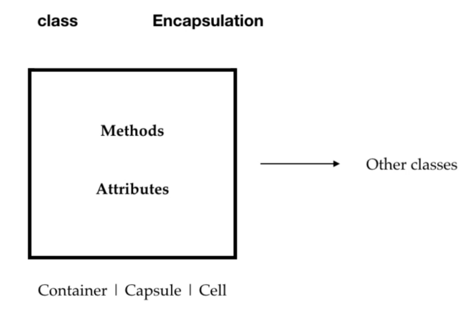

# OOPS in Java.
## 4 OOPS principal in java.

**Encapsulation** - Encapsulation means data hiding.

**Abstraction** - Abstraction means hiding the implementation.

**Inheritance** - Inheritance is a process where child class acquires the properties of super class.

**Polymorphism** -

Compile time polymorphism - can be achieved by using Method overloading.

Runtime polymorphism - Runtime polymorphism can be achieved by using Method overriding.

---
### Difference between Abstract Class and Interface.

| Abstract Class                      | Interface                                                                            |
|:------------------------------------|:-------------------------------------------------------------------------------------|
| Can extend only one abstract class. | Can imlement any number of interfaces.                                               |
| Can have abstract methods and concrete methods. | Can have abstract method, static, defaut, private methods.                           |
| In abstract call, the keyword `abstract` is used to declare a method as abstract. | In interface all the methods are abstract by default. No such keywords are required. |
| Abstract class can have static, final, static final variable with any access specifier. | Interface can only have static final variable by default. |

We cannot create an object of an abstract class.

We can use interfaces when we want to create a service requirement specification for any class that is the blueprint of any class to specify what a class must do. 

And we can use abstract classes to provide a base for subclasses to extend and implement the abstract methods and use the implemented methods which are defined in abstract class.

---
## Abstraction

Abstraction is an act of representing essential features without implementing the background details or explanation.

Hiding the internal implementation and showing the services. Like we use app and it does not shows the internal work of the app.

**Data Hiding is hiding the data and Abstraction is hiding the internal implementation.**

We achieve the data hiding by making the data members private and we achieve abstraction by using interfaces and abstract classes. 

---

[comment]: <> (This is the comment in md file.)
[comment]: <> (in order to make table in md file.
| Attempt | #1    | #2    |
| :---:   | :---: | :---: |
| Seconds | 301   | 283   |
)

