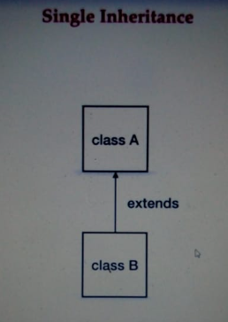
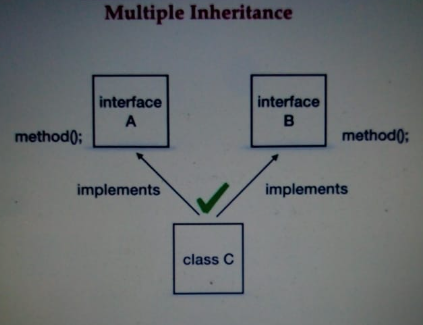
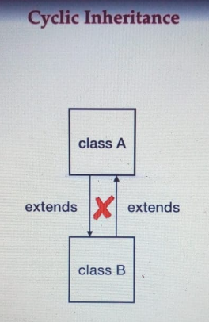

# OOPS in Java.
## 4 OOPS principal in java.

**Encapsulation** - Encapsulation means data hiding.

**Abstraction** - Abstraction means hiding the implementation.

**Inheritance** - Inheritance is a process where child class acquires the properties of super class.

**Polymorphism** -

Compile time polymorphism - can be achieved by using Method overloading.

Runtime polymorphism - Runtime polymorphism can be achieved by using Method overriding.

---
### Difference between Abstract Class and Interface.

| Abstract Class                      | Interface                                                                            |
|:------------------------------------|:-------------------------------------------------------------------------------------|
| Can extend only one abstract class. | Can imlement any number of interfaces.                                               |
| Can have abstract methods and concrete methods. | Can have abstract method, static, defaut, private methods.                           |
| In abstract call, the keyword `abstract` is used to declare a method as abstract. | In interface all the methods are abstract by default. No such keywords are required. |
| Abstract class can have static, final, static final variable with any access specifier. | Interface can only have static final variable by default. |

We cannot create an object of an abstract class.

We can use interfaces when we want to create a service requirement specification for any class that is the blueprint of any class to specify what a class must do. 

And we can use abstract classes to provide a base for subclasses to extend and implement the abstract methods and use the implemented methods which are defined in abstract class.

---
## Abstraction

Abstraction is an act of representing essential features without implementing the background details or explanation.

Hiding the internal implementation and showing the services. Like we use app and it does not shows the internal work of the app.

**Data Hiding is hiding the data and Abstraction is hiding the internal implementation.**

We achieve the data hiding by making the data members private and we achieve abstraction by using interfaces and abstract classes. 


## Encapsulation.
Grouping up of data members and member functions in a single unit is called Encapsulation.

Example a class is an encapsulation, class is a container which encapsulate the set of methods, attributes and properties to provide internal functionality to the other class.

Encapsulation hides how the class does it but to allow requesting the class what to do.

**Data Hiding + Abstraction = Encapsulation.**

**Tightly Encapsulation** A class where all the data members are private. 

---

## Inheritance Is-A Relationship.

Inheritance Is-A Relationship.

Association Has-A Relationship.

 Composition and Aggregation are part of Has-A Relationship.

**Inheritance**

Inheritance is a mechanism of creating new class deriving the old class.
New Class extends Old Class.
(Derived class, Child Class, Subclass) extends (Super class, Parent Class, Base class).

In Inheritance the child class gets all the properties of the parent class. This type of relationship is called IS-A Relationship.

Developer is a employee.  Here employee is the base class and the developer and the manager is the child class. Employee extends Manager.

### There are total 5 types of Inheritance.

****Single Inheritance.****

****Multilevel Inheritance.****

****Multiple Inheritance.****

******Hierarchical Inheritance.******

****Hybrid Inheritance.****

### Single Inheritance

Only one parent and one child.
```java
class A{
    
}
class B extends A{
    
}

```

### MultiLevel Inheritance
```java
class A{
    
}
class B extends A{
    
}
class C extends B{
    
}
```


### Multiple Inheritance

When the class has more than one parent is called Multiple Inheritance.
Java does not support this.

If C extends A and B both, then there is a chance of ambiguity problem.
That is, if there is any method present with the same name inside both the class. So this is ambiguity that which method is to call on runtime if it is invoked. This is also called Diamond Ambiguity Problem.

In interfaces multiple inheritance is possible. Interfaces has only declaration, not the implementation. So if there is a similar method with same name present inside both interfaces A and B, then there is only multiple declaration.


```java
class A{}
class AA{}
class C extends A,AA{}
//This is not allowed.
```

Interface
```java
interface AA{}
interface AAA{}
class B implements AA,AAA{}
```
Scenario where we have default method with same name inside two interfaces.
```java
interface AA{
    default void method(){
        System.out.println("Method of AA");
    }
}
interface AAA{
    default void method(){
        System.out.println("Method of AAA");
    }
}
class B implements AA,AAA{
    // Override or implement the method.
    public void method(){
        AA.super.method();
    }
}
```

### Hierarchical Inheritance
When a single base or parent class has multiple child classes. Class A has 2 children B and C.


### Hybrid Inheritance
Hybrid inheritance is combination of multiple inheritance and multi-level inheritance.

Class D is trying to extend class B and class C. This is not possible.

### Cyclic Inheritance
When one class extends itself or its subclass, then it is called cyclic.



This is not allowed in Java.

---

## Association HAS-A Relationship.

Establishing relationship between two different classes through their objects.

We use objects of two different classes in a class and make them interact with each other. This is association. There are two forms of association, **aggregation** and **composition**.

**Aggregation** 

Association is said to be aggregation if both the entities that are associated can exist independently.

These two entities are associated in a way that one contains other in a has a relationship. For example, college has a teacher, office has an employee.
Office and Employee are separate entity. 

Though destroying one entity will not affect other like without college teacher may exist in a different environment.

```java
class College{
    String name;
    private List<Teacher> teachers;
    //Constructor
    public College(String name, List<Teacher> teacher){
        this.name = name;
        this.teachers = teacher;
    }
    //Getter to get the teacher name.
    public List<Teacher> getTeachers(){
        return teachers;
    }
}

class Teacher{
    String name;
    String subject;
    public Teacher(String name, String subject){
        this.name = name;
        this.subject = subject;
    }
    @Override
    public String toString(){
        return "Teacher "+name+"Subject "+subject;
    }
}

public class oops6Aggregation {
    //A teacher object, and then we'll add that teacher object to the list.
    //Then we will pass that list with along with the name of the college to the College object.
    public static void main(String[] args) {
        List<Teacher> teacherName = new ArrayList<>();
        teacherName.add(new Teacher("Rohn","Java"));
        teacherName.add(new Teacher("Brad","JavaScript"));

        //Object of College Class
        College myCollege = new College("XYZ",teacherName);
        //We know establishing a relationship between two different classes is association. 
        // So in this program we pass the object of teacher class to the college class.
    }
}
```

This is called Aggregation. 

College HAS-A teacher.

Aggregation is where one entity contains other one, but both can survive independently. Without this college class, a teacher can survive independently.

**Composition**

Composition is a stronger form of association in which two entities are highly dependent on each other. Consider the case of a car having an engine or a human having a heart. A car cannot exist without engine. That engine also cannot exist without car.

# Polymorphism

Polymorphism means many forms.
Polymorphism is te ability of an object to take many form.

### Method Signature

```java
<Method Name>(<Argument Type>)
```

In the code
```java
class Demo{
    public void Display(String name){
        System.out.println(name);
    }
}
```

The method signature of this method is **Display(String)**.
The method signature donot include the return type.

Method Signature is used by compilers to resolve method calls.

When we create an object of a class it search for the method signature.
We cannot make methods of same method signature even the return type is different.
```java
class Demo {
    // This will give error as it is not allowed to write methods of same methods signature.
    public void display(String name) {
    }

    public String display(String info) {
    }
}    
```
Method overloading is a feature that allows a class to have more than one method with same name but having different argument list.

**Same Method Name - Different Argument List**.

```java
class Demo{
    public void display(String name){
        System.out.println(name);
    }
    public int display(int info){
        System.out.println(info);
    }
}
```

When we call these methods, then compiler results the method calls on the basis of arguments we pass.

```java
class Main{
    public static void main(String[] args) {
        Demo d= new Demo();
        d.display("Rohan");
        d.display(100);
    }
}
```

Since compiler check which method to call this is also called **Compile Time Polymorphism.**

Check the file oopsOverLoading
```java
class Demo{
    public int sumOfTwoNumbers(int a, int b){
        return a+b;
    }
    public double sumOfTwoNumbers(double a, double b){
        return a+b;
    }
    public int sumOfTwoNumber(int a, int b, int c){
        return a+b+c;
    }
}
public class oopsOverLoading {
    public static void main(String[] args) {
        Demo d= new Demo();
        System.out.println(d.sumOfTwoNumbers(8,9));
        System.out.println(d.sumOfTwoNumber(7,8,9));
    }
}
```

At the time of compilation, the method calls gets resolved by the compiler
and that is why this is called early binding.
Early binding because compiler does this thing before running the code.

In practical example say one API calls for user name and id so there is the method
getDetails(int id, String name). Later it is changed and the api should return name, id and password.
Now we cannot change the method as this method might be used by some other service.
So we user method overloading getDetails(int id, String name, String password).

## Method Overriding

When we extend any class, then all of its methods will get available to the subclass. So we can use those functionalities in the subclass.
And if we want to provide different implementation to those methods, then we can do so by method overriding.

Method overriding allows us to redefine the implementation of the method which is provided by the base class.
```java
class Base{
    public void show(){
        // Implementation
    }
}
class Derived extends Base{
    public void show(){
        // Implementation
    }
}
```
Now the question is how to call these methods?
And who will decide that which version of overridden method will be called.

In Method Overloading the compiler works to resolve the method. In Method Overriding the JVM resolves the method.
On the basis of the object call it determines the method call.

```java
class Main{
    public static void main(String[] args) {
        Base b = new Base();
        b.show();
        // The JVM will call the method of the base class.
        Derived d = new Derived();
        d.show();
        // The JVM will call the method of derived class.
        // The JVM will first call the method of the Derived class if no method is overriding then it will call the method of the base class.
    }
}
```

There are cases when we have parent type of reference, but child type of object.
So we are creating object like this base object, we are using parent type reference.
The reference is of base type, the object is still of derived one.
```java
class Main{
    public static void main(String[] args) {
        Base obj = new Derived();
        obj.show();
        // The derived method will call.
    }
}
```

Since on the basis of runtime object, the method resolution takes place.
Hence this time the show method of derived class will be called.

** When we create an object with the new keyword then the method will be call of that class.**

There is one more case child reference and parent object.
```java
Derived obj = new Base();
// This is not valid.
```

** Type of the object that is referred to determines which version of the overridden method will be executed.**

Since runtime object determines which method is going to be called, hence method overriding is also called as runtime polymorphism or late binding.
