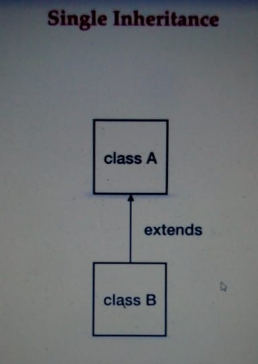
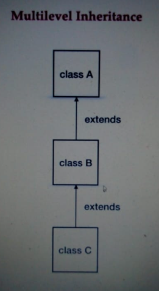
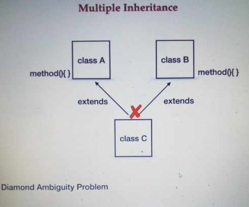
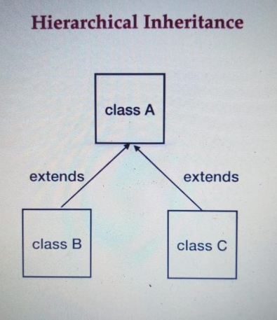
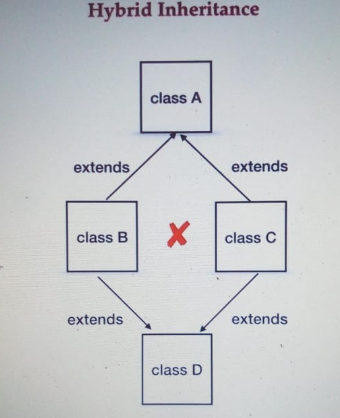
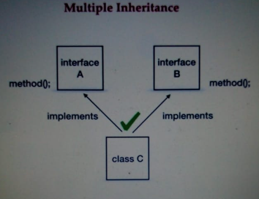

# OOPS in Java.
## 4 OOPS principal in java.

**Encapsulation** - Encapsulation means data hiding.

**Abstraction** - Abstraction means hiding the implementation.

**Inheritance** - Inheritance is a process where child class acquires the properties of super class.

**Polymorphism** -

Compile time polymorphism - can be achieved by using Method overloading.

Runtime polymorphism - Runtime polymorphism can be achieved by using Method overriding.

---
### Difference between Abstract Class and Interface.

| Abstract Class                      | Interface                                                                            |
|:------------------------------------|:-------------------------------------------------------------------------------------|
| Can extend only one abstract class. | Can imlement any number of interfaces.                                               |
| Can have abstract methods and concrete methods. | Can have abstract method, static, defaut, private methods.                           |
| In abstract call, the keyword `abstract` is used to declare a method as abstract. | In interface all the methods are abstract by default. No such keywords are required. |
| Abstract class can have static, final, static final variable with any access specifier. | Interface can only have static final variable by default. |

We cannot create an object of an abstract class.

We can use interfaces when we want to create a service requirement specification for any class that is the blueprint of any class to specify what a class must do. 

And we can use abstract classes to provide a base for subclasses to extend and implement the abstract methods and use the implemented methods which are defined in abstract class.

---
## Abstraction

Abstraction is an act of representing essential features without implementing the background details or explanation.

Hiding the internal implementation and showing the services. Like we use app and it does not shows the internal work of the app.

**Data Hiding is hiding the data and Abstraction is hiding the internal implementation.**

We achieve the data hiding by making the data members private and we achieve abstraction by using interfaces and abstract classes. 


## Encapsulation.
Grouping up of data members and member functions in a single unit is called Encapsulation.

Example a class is an encapsulation, class is a container which encapsulate the set of methods, attributes and properties to provide internal functionality to the other class.

Encapsulation hides how the class does it but to allow requesting the class what to do.

**Data Hiding + Abstraction = Encapsulation.**

**Tightly Encapsulation** A class where all the data members are private. 

---

## Inheritance Is-A Relationship.

Inheritance Is-A Relationship.

Association Has-A Relationship.

 Composition and Aggregation are part of Has-A Relationship.

**Inheritance**

Inheritance is a mechanism of creating new class deriving the old class.
New Class extends Old Class.
(Derived class, Child Class, Subclass) extends (Super class, Parent Class, Base class).

In Inheritance the child class gets all the properties of the parent class. This type of relationship is called IS-A Relationship.

Developer is a employee.  Here employee is the base class and the developer and the manager is the child class. Employee extends Manager.

### There are total 5 types of Inheritance.

****Single Inheritance.****

****Multilevel Inheritance.****

****Multiple Inheritance.****

******Hierarchical Inheritance.******

****Hybrid Inheritance.****

### Single Inheritance

Only one parent and one child.
```java
class A{
    
}
class B extends A{
    
}

```

### MultiLevel Inheritance
```java
class A{
    
}
class B extends A{
    
}
class C extends B{
    
}
```


### Multiple Inheritance

When the class has more than one parent is called Multiple Inheritance.
Java does not support this.

If C extends A and B both, then there is a chance of ambiguity problem.
That is, if there is any method present with the same name inside both the class. So this is ambiguity that which method is to call on runtime if it is invoked. This is also called Diamond Ambiguity Problem.

In interfaces multiple inheritance is possible. Interfaces has only declaration, not the implementation. So if there is a similar method with same name present inside both interfaces A and B, then there is only multiple declaration.


```java
class A{}
class AA{}
class C extends A,AA{}
//This is not allowed.
```

Interface
```java
interface AA{}
interface AAA{}
class B implements AA,AAA{}
```
Scenario where we have default method with same name inside two interfaces.
```java
interface AA{
    default void method(){
        System.out.println("Method of AA");
    }
}
interface AAA{
    default void method(){
        System.out.println("Method of AAA");
    }
}
class B implements AA,AAA{
    // Override or implement the method.
    public void method(){
        AA.super.method();
    }
}
```

### Hierarchical Inheritance
When a single base or parent class has multiple child classes. Class A has 2 children B and C.


### Hybrid Inheritance
Hybrid inheritance is combination of multiple inheritance and multi-level inheritance.

Class D is trying to extend class B and class C. This is not possible.

### Cyclic Inheritance
When one class extends itself or its subclass, then it is called cyclic.
